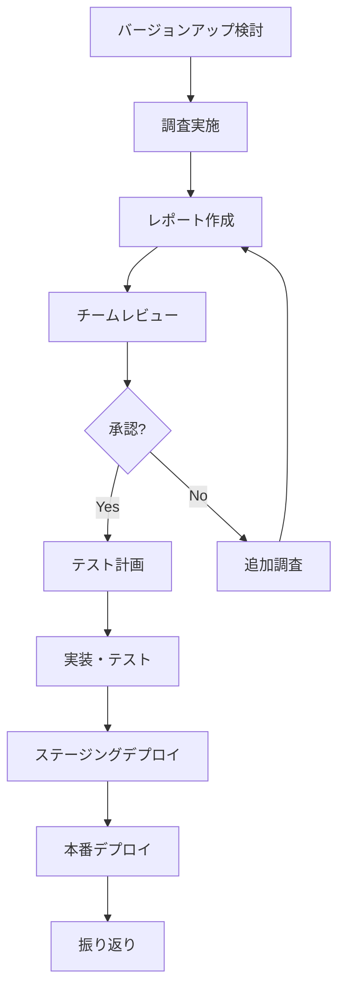

# Upgrade Analyzer 使用ガイド

## 目次

1. [基本的な使い方](#基本的な使い方)
2. [詳細ワークフロー](#詳細ワークフロー)
3. [プロンプトのカスタマイズ](#プロンプトのカスタマイズ)
4. [レポートの活用](#レポートの活用)
5. [チーム運用](#チーム運用)
6. [FAQ](#faq)

---

## 前提条件

このガイドは、`upgrade-analyzer` ディレクトリを既に入手済みで、Cursor最新版 + Browser機能ONの環境を前提としています。

> 💡 セットアップ方法は [README.md](./README.md) を参照してください。

---

## 基本的な使い方

### 方法A: スラッシュコマンド（推奨）

最も簡単な方法です。このプロジェクトディレクトリ内で以下のコマンドを実行するだけです：

```text
/upgrade-analyzer <製品名> <バージョンFrom> <バージョンTo> [プロジェクト情報]
```

**引数**:
- `<製品名>`: アップグレード対象の製品名（必須）
- `<バージョンFrom>`: 現在のバージョン（必須）
- `<バージョンTo>`: アップグレード先のバージョン（必須）
- `[プロジェクト情報]`: プロジェクトの文脈・背景・目的（オプション）

**基本的な実行例**:

```text
/upgrade-analyzer Next.js 15.4 15.5.3
/upgrade-analyzer React 18.2.0 18.3.1
/upgrade-analyzer PostgreSQL 14.1 15.0
```

**プロジェクト情報を含めた実行例（推奨）**:

```text
/upgrade-analyzer Next.js 15.4 15.5.3 "Eコマースサイト、月間100万PV、決済機能（Stripe連携）が重要、SEOとパフォーマンスが最優先"

/upgrade-analyzer React 18.2.0 18.3.1 "社内の勤怠管理システム、認証とアクセス制御が重要、ダウンタイム許容度低"

/upgrade-analyzer PostgreSQL 14.1 15.0 "金融系SaaSのデータベース、トランザクション整合性とセキュリティが最重要、24時間365日稼働、PCI-DSS準拠必須"

/upgrade-analyzer TypeScript 5.0 5.3 "大規模なモノリポ構成、マイクロサービス30個以上、型安全性とビルド速度が重要"
```

💡 **プロジェクト情報を指定するメリット**:
- プロジェクトの重要機能に特化したテスト観点が提供される
- ビジネス要件に応じたリスク評価が行われる
- プロジェクトのKPIに合わせた成功基準が設定される
- より具体的で実践的な推奨事項が得られる

**実行されること**:

1. AIが自動的に公式リリースノート、GitHub Issues、セキュリティアドバイザリを調査
2. プロジェクトコンテキストを考慮した完全なMarkdownレポートを生成
3. `reports/` ディレクトリに自動保存

> 💡 **Tip**: 全プロジェクトで使えるようにするには、[SLASH_COMMAND_SETUP.md](./SLASH_COMMAND_SETUP.md) を参照してください。

---

### 方法B: プロンプトテンプレート（カスタマイズ派向け）

プロンプトをカスタマイズしたい場合は、この方法を使用します。

#### Step 1: プロンプトテンプレートを開く

```bash
# upgrade-analyzerディレクトリに移動
cd upgrade-analyzer

# テンプレートを確認
cat templates/prompt_template.md
# または、お好みのエディタで開く
open templates/prompt_template.md
```

#### Step 2: 【変数設定】を編集

プロンプトの先頭にある**【変数設定】セクション**だけを編集します：

```text
---
【変数設定】※ここだけ編集してください
製品名: Next.js          ← ここに製品名を入力
バージョンFrom: 15.4     ← ここに現在のバージョンを入力
バージョンTo: 15.5.3     ← ここにアップグレード先のバージョンを入力
---
```

**それ以外の本文は変更不要です。** AIが自動的に変数を参照します。

#### Step 3: Cursorのチャットに入力

編集したプロンプト全体をCursorのチャットに入力します。

#### Step 4: 結果をMarkdownファイルとして保存

AIからの回答は**Markdown形式のレポート**として出力されます。
これをそのまま `reports/` ディレクトリに保存してください。

#### 保存手順

1. **AIの回答全体をコピー**（`# {製品名}...` から最後まで）
2. **ファイルを作成**:

   ```bash
   # ファイル名の命名規則
   reports/{製品名}_{バージョンFrom}_to_{バージョンTo}_{YYYYMMDD}.md
   
   # 例
   reports/nextjs_15.4_to_15.5.3_20251006.md
   ```

3. **コピーした内容を貼り付けて保存**

#### VSCode/Cursorでの保存例

```bash
# reportsディレクトリで新規ファイル作成
touch reports/nextjs_15.4_to_15.5.3_20251003.md

# エディタで開いて、AIの回答を貼り付け
code reports/nextjs_15.4_to_15.5.3_20251003.md
```

#### ファイル確認

```bash
# 保存したファイルをプレビュー
open reports/nextjs_15.4_to_15.5.3_20251003.md

# または
cat reports/nextjs_15.4_to_15.5.3_20251003.md
```

💡 **Tip**: 保存したMarkdownファイルは、GitHub、GitLab、Notionなどで美しく表示されます。

---

## 詳細ワークフロー

### 1. 調査計画フェーズ

#### 1.1 調査対象の明確化

```markdown
## バージョンアップ対象

- 製品名: Next.js
- 現行バージョン: 15.0
- 移行先バージョン: 15.5.3
- 理由: セキュリティ修正、パフォーマンス改善
- 期限: 2025-10-31
- 担当者: @username
```

#### 1.2 影響範囲の仮説立て

プロンプト実行前に、予想される影響を記録しておきます：

```markdown
## 事前の仮説

- API変更: 少ないと予想（Minorバージョンアップのため）
- ビルド時間: Turbopack導入で短縮期待
- 動的ルーティング: 修正が入っているので要確認
```

### 2. 調査実行フェーズ

#### 2.1 Web検索の実行

AIアシスタントは自動的に以下を検索します：

- 公式リリースノート
- GitHub Releases
- セキュリティアドバイザリ
- マイグレーションガイド
- コミュニティの報告

#### 2.2 情報の整理

AIが以下の形式で情報を整理します：

- 変更点の分類（Breaking/Bug/Feature/Performance）
- 影響範囲の特定（Code/Config/Build/Runtime）
- テスト観点の提案（優先度付き）
- リスク評価

### 3. レポート作成フェーズ

#### 3.1 レポートの保存

```bash
# 出力をファイルに保存
reports/nextjs_15_to_15.5.3_20251003.md
```

#### 3.2 レポートのレビュー

チェックリスト：

- [ ] すべての変更点がカバーされているか
- [ ] 出典URLが記載されているか
- [ ] テスト観点が具体的か
- [ ] リスク評価が妥当か
- [ ] 成功基準とKPIが明確か

### 4. テスト計画フェーズ

#### 4.1 テストケースの作成

レポートのテスト観点を基に、具体的なテストケースを作成します。

```bash
# testcase_generatorと連携（オプション）
# ※ testcase_generatorが同じディレクトリ階層にある場合
cd ../testcase_generator
python generate_testcases.py --input ../upgrade-analyzer/reports/nextjs_15_to_15.5.3_20251003.md
```

#### 4.2 テスト環境の準備

```bash
# テスト用ブランチ作成
git checkout -b test/nextjs-15.5.3

# 依存関係のインストール
npm install next@15.5.3
```

### 5. 実施・検証フェーズ

#### 5.1 段階的な実施

```text
dev環境 → staging環境 → 本番環境（カナリア） → 本番環境（全体）
```

#### 5.2 監視とロールバック準備

- エラー率の監視
- パフォーマンスの監視
- ロールバック手順の確認

---

## プロンプトのカスタマイズ

### プロジェクトコンテキストの活用

スラッシュコマンドの第4引数でプロジェクト情報を指定することで、より具体的な分析が可能になります。

#### 推奨される情報

```text
"[プロジェクトタイプ]、[規模]、[重要機能]、[優先事項]、[制約条件]、[技術スタック]、[コンプライアンス]"
```

**項目の詳細**:
- **プロジェクトタイプ**: Eコマース、SaaS、社内ツール、コンテンツサイト、API等
- **規模**: トラフィック量、ユーザー数、データ量
- **重要機能**: ビジネスクリティカルな機能（決済、認証、データ処理等）
- **優先事項**: パフォーマンス、セキュリティ、SEO、可用性等
- **制約条件**: ダウンタイム許容度、予算、開発リソース、納期
- **技術スタック**: 主要な関連技術（フレームワーク、ライブラリ、インフラ）
- **コンプライアンス**: 業界規制、法的要件（PCI-DSS、HIPAA、GDPR等）

#### 良い例

```text
/upgrade-analyzer Next.js 14 15.1 "Eコマースサイト、月間500万PV、年間流通額50億円、決済機能（Stripe連携）とカート機能が最重要、ダウンタイム許容度低、PCI-DSS準拠必須、Next.js + Vercel、SEOとCore Web Vitalsが重要"
```

#### 避けるべき例

```text
/upgrade-analyzer Next.js 14 15.1 "Webサイト"  # 情報が不足
```

### プロジェクト固有の要件を追加（プロンプトテンプレート使用時）

```markdown
8. **プロジェクト固有の確認事項**
   - 既存の認証システム（Auth.js）への影響
   - Prismaとの互換性
   - Vercel環境での動作確認
   - 社内UIライブラリとの互換性
```

### 複数製品の同時調査

```markdown
以下の製品のバージョンアップを予定しています。
それぞれの影響と相互の依存関係を考慮して調査してください：

- Next.js: 15 → 15.5.3
- React: 18.2.0 → 18.3.1
- TypeScript: 5.2.2 → 5.3.3
- Node.js: 20.10.0 → 20.18.0

特に以下の点を重視してください：
- 各製品間の依存関係
- 推奨される更新順序
- 互換性マトリクス
```

### セキュリティ重視の調査

```markdown
{製品名}の{バージョンFrom}から{バージョンTo}にバージョンアップを予定しています。
**セキュリティ修正を最優先**として調査してください。

重点調査項目：
1. CVE修正内容と重要度
2. セキュリティアドバイザリ
3. 脆弱性の影響範囲（CVSS スコア含む）
4. 緊急度評価と対応期限
5. パッチ適用の推奨タイムライン
```

### パフォーマンス重視の調査

```markdown
{製品名}の{バージョンFrom}から{バージョンTo}にバージョンアップを予定しています。
**パフォーマンス改善**を目的としています。

重点調査項目：
1. パフォーマンス改善内容
2. ベンチマーク結果（公式データ）
3. 測定方法と再現手順
4. トレードオフ（メモリ使用量など）
5. 最適化のベストプラクティス
```

---

## レポートの活用

### チケット管理システムとの連携

#### Jira

```markdown
## Jiraチケット作成例

**タイトル**: [Tech Debt] Next.js 15 → 15.5.3 アップグレード

**説明**:
{レポートのサマリを貼り付け}

**受け入れ条件**:
- [ ] ビルドが正常完了
- [ ] E2Eテスト100%通過
- [ ] 本番デプロイ成功

**添付ファイル**:
- reports/nextjs_15_to_15.5.3_20251003.md
```

#### GitHub Issues

```markdown
## Upgrade Next.js to 15.5.3

### Summary
{レポートのサマリ}

### Checklist
- [ ] Review impact analysis report
- [ ] Run high-priority tests
- [ ] Update CI/CD pipeline
- [ ] Deploy to staging
- [ ] Monitor production

### Related Documents
- [Impact Analysis Report](./reports/nextjs_15_to_15.5.3_20251003.md)
```

### ドキュメントへの統合

```markdown
# プロジェクトドキュメント

## バージョン履歴

| 日付 | 製品 | From | To | レポート | 担当 |
|------|------|------|----|---------|----|
| 2025-10-15 | Next.js | 15.0 | 15.5.3 | [Link](../upgrade-analyzer/reports/nextjs_15_to_15.5.3_20251003.md) | @username |
```

---

## チーム運用

### ロールと責任

| ロール | 責任 |
|--------|------|
| **調査担当** | プロンプト実行、レポート作成、初期レビュー |
| **技術リード** | レポートレビュー、リスク評価、Go/No-Go判断 |
| **QA** | テスト計画作成、テスト実行、品質保証 |
| **DevOps** | CI/CD調整、デプロイ戦略、監視設定 |

### ワークフロー例



### レビューミーティング

**アジェンダ**:

1. レポートの概要説明（5分）
2. 主要変更点のディスカッション（10分）
3. リスク評価とリスク軽減策（10分）
4. テスト戦略の合意（10分）
5. スケジュール確認（5分）

**参加者**:

- 技術リード
- 調査担当
- QA担当
- DevOps担当

---

## FAQ

### Q0: スラッシュコマンドとプロンプトテンプレート、どちらを使うべきですか？

**A**: 用途に応じて使い分けてください：

**スラッシュコマンド（推奨）**:

- ✅ 最速（1分以内）
- ✅ コピー&ペースト不要
- ✅ プロジェクトコンテキストを指定可能
- ✅ 標準的な調査に最適
- 使い方: `/upgrade-analyzer <製品名> <FromVersion> <ToVersion> [プロジェクト情報]`

**プロンプトテンプレート**:

- ✅ 完全にカスタマイズ可能
- ✅ 調査項目を追加・削除できる
- ✅ 特殊な要件がある場合に最適
- 使い方: `templates/prompt_template.md` を編集して使用

> 💡 **Tip**: 最初はスラッシュコマンド（プロジェクト情報付き）を試して、必要に応じてプロンプトテンプレートでカスタマイズしましょう。

### Q0-1: プロジェクト情報は必須ですか？

**A**: オプションですが、指定することを強く推奨します：

**プロジェクト情報なし**:
- 一般的な影響分析レポートが生成される
- 汎用的なテスト観点とリスク評価

**プロジェクト情報あり（推奨）**:
- プロジェクトに特化した影響分析
- ビジネス要件に応じたリスク評価
- 重要機能に焦点を当てたテスト観点
- プロジェクトのKPIに合わせた成功基準

**例**:
```text
# 基本（一般的なレポート）
/upgrade-analyzer Next.js 14 15.1

# 推奨（具体的なレポート）
/upgrade-analyzer Next.js 14 15.1 "Eコマースサイト、決済機能が重要、月間100万PV"
```

### Q1: どのくらいの頻度で調査すべきですか？

**A**: 以下のタイミングで調査を推奨します：

- セキュリティ修正: 即座（CVE公開後24-48時間以内）
- Major版アップ: 計画的（リリース後1-2ヶ月以内）
- Minor版アップ: 四半期ごと
- Patch版アップ: 月次または必要に応じて

### Q2: すべての依存関係を調査する必要がありますか？

**A**: 優先度をつけて対応します：

1. **最優先**: フレームワーク、ランタイム（Next.js, Node.js等）
2. **高優先**: セキュリティ関連、直接依存（react, express等）
3. **中優先**: 開発ツール（TypeScript, ESLint等）
4. **低優先**: 間接依存（transitive dependencies）

### Q3: AIの調査結果はどこまで信頼できますか？

**A**: 以下の点を確認してください：

- ✅ 出典URLが記載されているか
- ✅ 公式ソースが引用されているか
- ✅ 発行日が明記されているか
- ⚠️ 複数の情報源で裏付けを取る
- ⚠️ 重要な決定は公式ドキュメントで再確認

### Q4: レポートが長すぎる場合は？

**A**: エグゼクティブサマリを先頭に追加します：

```markdown
## エグゼクティブサマリ（1分で読める）

- **判定**: ✅ アップグレード推奨
- **重要度**: 中
- **工数見積**: 4-8時間
- **最大リスク**: 動的ルーティング（軽微）
- **推奨時期**: 2週間以内
```

### Q5: 複数のプロジェクトで同じライブラリをアップグレードする場合は？

**A**: レポートを再利用します：

```bash
# 共有レポートとして保存
reports/shared/nextjs_15_to_15.5.3.md

# プロジェクト固有の注釈を追加
reports/project-a/nextjs_15_to_15.5.3_notes.md
reports/project-b/nextjs_15_to_15.5.3_notes.md
```

### Q6: アップグレードを見送る判断基準は？

**A**: 以下の場合は延期を検討します：

- ❌ Breaking Changesが多く、影響が大きい
- ❌ 重大なバグ報告がコミュニティで多数
- ❌ 主要プラグインが未対応
- ❌ プロジェクトが重要なリリース直前
- ⚠️ 十分なテスト時間が確保できない

---

## ベストプラクティス

### 1. 定期的な調査

月次でメジャーライブラリの最新版を確認し、レポートを作成します。

### 2. ナレッジベース化

過去のレポートを検索可能な形で保管し、チーム内で共有します。

### 3. 自動化の推進

```bash
# 依存関係の自動チェック
npm outdated

# セキュリティ監査
npm audit

# 定期的なレポート生成（Cronで実行）
# /path/to/your/project を実際のプロジェクトパスに置き換えてください
0 9 * * 1 cd /path/to/your/project && npm outdated | mail -s "Weekly Dependency Report" team@example.com
```

### 4. テンプレートの継続改善

実施結果を基に、プロンプトテンプレートを改善し続けます。

### 5. チーム内での標準化

すべてのバージョンアップでこのプロセスを標準化し、属人化を防ぎます。

---

## 関連ツール

### impact-cli との連携

```bash
# SBOMから自動抽出
impact /discover --sbom out/cyclonedx.json

# 影響分析レポート生成
impact /impact --products "next@15->15.5.3" --output both
```

### testcase_generator との連携

```bash
# レポートからテストケース生成（オプション）
# ※ testcase_generatorが同じディレクトリ階層にある場合
cd ../testcase_generator
python generate_testcases.py \
  --input ../upgrade-analyzer/reports/nextjs_15_to_15.5.3_20251003.md \
  --output test_cases/
```

---

## サポート

### 問題が発生した場合

1. [examples/](./examples/) で類似事例を確認
2. プロンプトを調整して再実行
3. チーム内で相談
4. 公式ドキュメントを直接確認

### フィードバック

このツールの改善提案は、プロジェクトREADMEにIssueを作成してください。

---

**ガイドバージョン**: 3.1  
**最終更新**: 2025-10-06（v3.1: プロジェクトコンテキスト対応）
